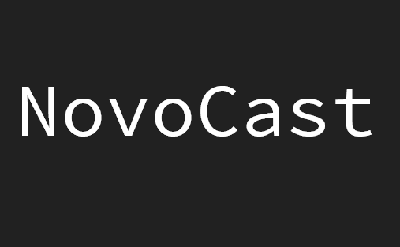

<h1 align="center">
   
  
   
  V1
</h1>

<h4 align="center">Roku Channel to receive images and videos from the NovoCast Chrome extension.</h4>

MIT. Copyright (c) [Wilkin Novo](https://github.com/T1263).
